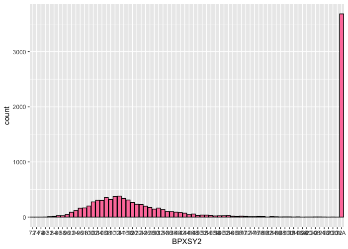

<!-- README.md is generated from README.Rmd. Please edit that file -->

# nhanesGraph

<!-- badges: start -->

[](https://github.com/minjee-kim/nhanesGraph/actions/workflows/R-CMD-check.yaml)
<!-- badges: end -->

nhanesGraph is a package that provides an accessible and interactive way
for users to export NHANES data as well as view data trends via Shiny
package. This package is an extension of the
[RNHANES](https://cran.r-project.org/web/packages/RNHANES/vignettes/introduction.html)
package created by Herb Susmann.

## Installation

You can install the development version of nhanesGraph from
[GitHub](https://github.com/minjee-kim/nhanesGraph) with:

``` r
# install.packages("devtools")
devtools::install_github("minjee-kim/nhanesGraph")
```

## Data Loading via nhanes_table function

From the console, the NHANES data can be accessed via nhanes_table()
function by specifying the cycle (or a specific year), file name, and
whether to include demographic information for the samples in the data
in the loaded data. The demographics parameter is False by default. The
recode parameter allows users to load the data with descriptive
categorical variables. By default, recode is False.

``` r
library(nhanesGraph)

head(nhanes_table("2008", "EPH", demographics = T, recode = T))
#> Downloading EPH_E.XPT to /var/folders/cb/pm2sn91x1kl5y2ch704fh_8c0000gn/T//RtmptePzwt/EPH_E.XPT
#> Downloading EPH_E.htm to /var/folders/cb/pm2sn91x1kl5y2ch704fh_8c0000gn/T//RtmptePzwt/EPH_E.htm
#> Downloading DEMO_E.XPT to /var/folders/cb/pm2sn91x1kl5y2ch704fh_8c0000gn/T//RtmptePzwt/DEMO_E.XPT
#> Caching CSV to /var/folders/cb/pm2sn91x1kl5y2ch704fh_8c0000gn/T//RtmptePzwt/DEMO_E.csv
#> Downloading DEMO_E.htm to /var/folders/cb/pm2sn91x1kl5y2ch704fh_8c0000gn/T//RtmptePzwt/DEMO_E.htm
#>    SEQN     cycle                        SDDSRVYR
#> 1 41476 2007-2008 NHANES 2007-2008 Public Release
#> 2 41479 2007-2008 NHANES 2007-2008 Public Release
#> 3 41486 2007-2008 NHANES 2007-2008 Public Release
#> 4 41489 2007-2008 NHANES 2007-2008 Public Release
#> 5 41492 2007-2008 NHANES 2007-2008 Public Release
#> 6 41496 2007-2008 NHANES 2007-2008 Public Release
#>                            RIDSTATR                    RIDEXMON RIAGENDR
#> 1 Both Interviewed and MEC examined November 1 through April 30   Female
#> 2 Both Interviewed and MEC examined November 1 through April 30     Male
#> 3 Both Interviewed and MEC examined November 1 through April 30   Female
#> 4 Both Interviewed and MEC examined November 1 through April 30   Female
#> 5 Both Interviewed and MEC examined    May 1 through October 31     Male
#> 6 Both Interviewed and MEC examined    May 1 through October 31   Female
#>   RIDAGEYR RIDAGEMN RIDAGEEX                            RIDRETH1 DMQMILIT
#> 1        6       81       82 Other Race - Including Multi-Racial     <NA>
#> 2       52      629      630                    Mexican American       No
#> 3       61      734      735                    Mexican American       No
#> 4       40      482      483                    Mexican American       No
#> 5       72      866      866                  Non-Hispanic White       No
#> 6       64      776      777                    Mexican American       No
#>                                     DMDBORN2                           DMDCITZN
#> 1     Born in 50 US States or Washington, DC Citizen by birth or naturalization
#> 2                             Born in Mexico Citizen by birth or naturalization
#> 3                             Born in Mexico Citizen by birth or naturalization
#> 4     Born in 50 US States or Washington, DC Citizen by birth or naturalization
#> 5 Born in Other Non-Spanish Speaking Country Citizen by birth or naturalization
#> 6                             Born in Mexico            Not a citizen of the US
#>                     DMDYRSUS                           DMDEDUC3
#> 1                       <NA> Never Attended / Kindergarten Only
#> 2 20 yrs., less than 30 yrs.                               <NA>
#> 3 40 yrs., less than 50 yrs.                               <NA>
#> 4                       <NA>                               <NA>
#> 5 10 yrs., less than 15 yrs.                               <NA>
#> 6 10 yrs., less than 15 yrs.                               <NA>
#>                             DMDEDUC2 DMDSCHOL  DMDMARTL DMDHHSIZ DMDFMSIZ
#> 1                               <NA>     <NA>      <NA>        6        6
#> 2                Less Than 9th Grade     <NA>   Married        5        5
#> 3                Less Than 9th Grade     <NA>   Married        3        3
#> 4 High School Grad/GED or Equivalent     <NA>   Married        3        3
#> 5                Less Than 9th Grade     <NA>   Married        2        2
#> 6                Less Than 9th Grade     <NA> Separated        1        1
#>             INDHHIN2           INDFMIN2                            INDFMPIR
#> 1  $100,000 and Over  $100,000 and Over Value greater than or equal to 5.00
#> 2 $45,000 to $54,999 $45,000 to $54,999                                 2.2
#> 3 $25,000 to $34,999 $25,000 to $34,999                                1.75
#> 4 $35,000 to $44,999 $35,000 to $44,999                                2.15
#> 5 $10,000 to $14,999 $10,000 to $14,999                                1.02
#> 6 $ 5,000 to $ 9,999 $ 5,000 to $ 9,999                                0.59
#>                  RIDEXPRG DMDHRGND DMDHRAGE
#> 1                    <NA>     Male       51
#> 2                    <NA>     Male       52
#> 3                    <NA>     Male       67
#> 4 SP not pregnant at exam   Female       40
#> 5                    <NA>   Female       68
#> 6                    <NA>   Female       64
#>                                 DMDHRBR2                           DMDHREDU
#> 1 Born in 50 US States or Washington, DC          College Graduate or above
#> 2                         Born in Mexico                Less Than 9th Grade
#> 3                         Born in Mexico                Less Than 9th Grade
#> 4 Born in 50 US States or Washington, DC High School Grad/GED or equivalent
#> 5 Born in Other Spanish Speaking Country High School Grad/GED or equivalent
#> 6                         Born in Mexico                Less Than 9th Grade
#>    DMDHRMAR                           DMDHSEDU SIALANG SIAPROXY SIAINTRP
#> 1   Married          College Graduate or above English      Yes       No
#> 2   Married High School Grad/GED or equivalent Spanish       No       No
#> 3   Married                Less Than 9th Grade Spanish       No       No
#> 4   Married High School Grad/GED or equivalent English       No       No
#> 5   Married                Less Than 9th Grade English       No       No
#> 6 Separated                               <NA> Spanish       No       No
#>   FIALANG FIAPROXY FIAINTRP MIALANG MIAPROXY MIAINTRP AIALANG  WTINT2YR
#> 1 English       No       No    <NA>     <NA>     <NA>    <NA> 35057.218
#> 2 English       No       No Spanish       No       No Spanish  8727.798
#> 3 Spanish       No       No Spanish       No       No Spanish  5155.139
#> 4 English       No       No English       No       No English 25274.173
#> 5 English       No       No English       No       No English  7782.354
#> 6 Spanish       No       No Spanish       No       No Spanish  7480.950
#>    WTMEC2YR SDMVPSU SDMVSTRA   WTSB2YR URXUCR URX4TO
#> 1 35353.210       1       70 120437.91     72   0.14
#> 2  9234.056       1       70  30191.58    124   0.14
#> 3  5436.241       1       73  17219.29     72   0.14
#> 4 25651.324       1       66  77564.82     91   0.14
#> 5  8620.700       1       62  25621.60     49   0.14
#> 6  7390.024       1       71  23407.90     NA     NA
#>                      URD4TOLC URXBP3                        URDBP3LC URXBPH
#> 1 Below lower detection limit    5.5 At or above the detection limit    2.3
#> 2 Below lower detection limit   31.2 At or above the detection limit    1.1
#> 3 Below lower detection limit   50.5 At or above the detection limit    1.0
#> 4 Below lower detection limit   85.0 At or above the detection limit    1.5
#> 5 Below lower detection limit    1.2 At or above the detection limit    0.6
#> 6                        <NA>     NA                            <NA>     NA
#>                          URDBPHLC URXTRS                        URDTRSLC URXBUP
#> 1 At or above the detection limit   75.5 At or above the detection limit   0.14
#> 2 At or above the detection limit    7.4 At or above the detection limit   1.40
#> 3 At or above the detection limit  479.0 At or above the detection limit   0.14
#> 4 At or above the detection limit    9.4 At or above the detection limit  21.10
#> 5 At or above the detection limit   29.9 At or above the detection limit   0.14
#> 6                            <NA>     NA                            <NA>     NA
#>                          URDBUPLC URXEPB                        URDEPBLC URXMPB
#> 1     Below lower detection limit   1.90 At or above the detection limit   15.8
#> 2 At or above the detection limit   4.40 At or above the detection limit  105.0
#> 3     Below lower detection limit   0.71     Below lower detection limit  235.0
#> 4 At or above the detection limit   2.00 At or above the detection limit  140.0
#> 5     Below lower detection limit   0.71     Below lower detection limit    4.8
#> 6                            <NA>     NA                            <NA>     NA
#>                          URDMPBLC URXPPB                        URDPPBLC
#> 1 At or above the detection limit    0.8 At or above the detection limit
#> 2 At or above the detection limit    3.2 At or above the detection limit
#> 3 At or above the detection limit    1.4 At or above the detection limit
#> 4 At or above the detection limit   51.2 At or above the detection limit
#> 5 At or above the detection limit    0.3 At or above the detection limit
#> 6                            <NA>     NA                            <NA>
#>   file_name begin_year end_year
#> 1     EPH_E       2007     2008
#> 2     EPH_E       2007     2008
#> 3     EPH_E       2007     2008
#> 4     EPH_E       2007     2008
#> 5     EPH_E       2007     2008
#> 6     EPH_E       2007     2008
```

### File Search

In order to specify the year and file inputs in the nhanes_table
function, users can explore the NHANES files with nGraph_search Shiny
app. The Shiny app can be launched with the folloing code:

``` r
nGraph_search()
```

## Variable Visualization

To view the general trend of a variable, nhanes_viz function can be
used. The function has flexible parameter inputs for file name and
variable. If either of the parameters is null, the function takes
appropriate measures to search for the variable.

``` r
nhanes_viz(graph_type = "hist", file_name = "BPX_D", variable = "BPXSY2")
#> Downloading BPX_D.XPT to /var/folders/cb/pm2sn91x1kl5y2ch704fh_8c0000gn/T//RtmptePzwt/BPX_D.XPT
#> Warning: Ignoring unknown parameters: binwidth, bins, pad
```



### Variable Search

To explore all options of variables, ngraph_variable Shiny app can be
used. The Shiny app can be launched with the following code:

``` r
nGraph_variable()
```

### Future Work

Some future work for the package includes more diverse graphing options
for the nhanes_viz function and an integrated shiny app for viewing the
data trends.
