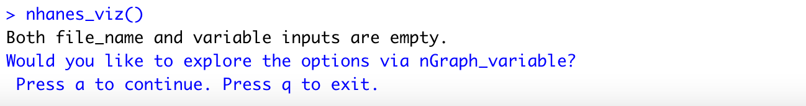

nhanesGraph provides an easy way to access and visualize data from [NHANES](https://www.cdc.gov/nchs/nhanes/index.htm?CDC_AA_refVal=https%3A%2F%2Fwww.cdc.gov%2Fnchs%2Fnhanes.htm), the National Health and Nutrition Examination Survey conducted by the Centers for Disease Control. 
This package serves as an extension to the [RNHANES](https://cran.r-project.org/web/packages/RNHANES/vignettes/introduction.html) package created by [Herb Susmann](http://herbsusmann.com/). 


```{r, include = FALSE}
knitr::opts_chunk$set(
  collapse = TRUE,
  comment = "#>"
)
```


The package invites the users to get started by installing the package from the [github](https://github.com/minjee-kim/nhanesGraph) repository via devtools. 
```{r setup}
# install.packages("devtools")
# devtools::install_github("minjee-kim/nhanesGraph", build_vignettes = TRUE)
library(nhanesGraph)
```

## NHANES 
NHANES is a national database of biomarker data that contains demographic, dietary, examination, laboratory, and questionnaire components. [Read more about NHANES](https://www.cdc.gov/nchs/nhanes/about_nhanes.htm) 
Continuous NHANES is a series of survey and examination of non-institutionalized residents of the United States, collected by the CDC since 1999. Although this database is widely used for research, the files are often difficult to work with using R. This package provides Shiny apps to help the users explore the various files and variables that NHANES has to offer using R, as well as access the data with more user friendly inputs. 

## Loading Data
nhanes_table function extends the nhanes_load_data() function in the RNHANES package. The file_name argument is necessary to run the code successfully. 

Previously, any function in RNHANES package required the users to specify the year input with a specific cycle format of "2007-2008." nhanes_table allows more flexible inputs such as any numeric year within 1999-2016 and a single year string input. 
```{r example, eval=F}
EPH2007data1 <- nhanes_table("2007","EPH")
head(EPH2007data1)

EPH2007data2 <- nhanes_table(2007,"EPH")
head(EPH2007data2)

EPH2007data3 <- nhanes_table("2007-2008","EPH")
head(EPH2007data3)
```

As the nhanes_table function serves as an extension of the RNHANES::nhanes_load_data() function, it inherits demographics and recode parameters from the pre-existing function. The logical demographics parameter decides whether to include the demographic information of the samples in the file, and the logical recode parameter allows the users to read the categorical variables as their character values, rather than as factors. 
```{r}
colnames(nhanes_table("2009-2010","UAS_F"))

colnames(nhanes_table("2009-2010","UAS_F", demographics = T, recode = T))
```


### Flexibility of Inputs

Furthermore, when the year input for nhanes_table includes multiple cycles, users are asked to choose from the cycle options via console. 
```{r, eval = F}
nhanes_table(year = "2010-2016", file_name = "DEMO")
```


```{r image1, echo=FALSE, fig.cap="Option Display", out.width = '100%'}

```

Choosing the option 3, the "DEMO" file in the cycle 2013-2014 displays. 

```{r image2, echo=FALSE, fig.cap="Data Display", out.width = '100%'}

```

### File Search

When the nhanes_table function is inputted without specifying the file name, the ngraph_search Shiny app launches to help the users search for the desired file. Currently, it is necessary for the users to exit the Shiny App by clicking the "close window" button on the top left corner of the Shiny app to avoid any conflict with the R session. 
```{r image3, echo=FALSE, fig.cap="File Search Option", out.width = '100%'}
knitr::include_graphics("file_search.png")
```


Selecting "a", the nGraph_search Shiny app launches. 


```{r image4, echo=FALSE, fig.cap="nGraph_search Display", out.width = '100%'}
knitr::include_graphics("ngraph_search.png")
```

The Shiny app for searching the files can also be accessed with the function ngraph_search(). 
```{r, eval=F}
nGraph_search()
```


## Data Visualization

Although it is quite difficult to view the overall trend of each data file, this package attempts to help the users visualize the trend of each variable. nhanes_viz function takes graph type (currently, the only available option is histogram), file name, and variable name. 


A basic example of nhanes_viz function: 
```{r,dpi=150, out.width = '\\maxwidth'}
nhanes_viz(graph_type = "Hist", file_name = "ENX_E", variable = "ENAATMPT")
```

If the file name is null but the variable is selected, nhanes_viz searches the files with the corresponding variable. If there are multiple files that contain the variable, the cycle options are displayed to work with the correct file. 
```{r, eval = F}
nhanes_viz(graph_type = "Hist", variable = "ENAATMPT")
```
By selecting the 2007-2008 option (option number 1), the function displays the same graph as the graph displayed by the basic example. This is because the "ENX_E" file inputted in the basic example is a file from the 2007-2008 cycle. 

```{r image6, echo=FALSE, fig.cap="nhanes_viz Null File Input Display", out.width = '100%'}

```


If the file name is inputted but the variable is not specified, nhanes_viz displays the options of variables to visualize. 
```{r, eval = F}
nhanes_viz(graph_type = "Hist", file_name = "ENX_E")
```

```{r image99, echo=FALSE, fig.cap="nhanes_viz Null Variable Display", out.width = '75%'}

```

By selecting "ENAATMPT" with option 1, the graph from basic example displays. 

### Variable Search 

Similar to the nhanes_table function, users are able to exclude all three of the inputs to explore the variable options. With the null inputs, console displays an option to display the variable search Shiny app.
```{r, eval=F}
nhanes_viz()
```

```{r image7, echo=FALSE, fig.cap="nhanes_viz Null Input Option Display", out.width = '100%'}

```

Pressing a, the following Shiny app launches. 

```{r image8, echo=FALSE, fig.cap="nGraph_variable Display", out.width = '100%'}

```

To explore the variables for a particular file, cycle, or component, users can access the Shiny app for variable search via nGraph_variable() function. 

```{r, eval = F}
nGraph_variable()
```


## Future Work 
The nhanesGraph package can be further extended to a cohesive Shiny app that allows users to explore the variable trends by specifying file name, cycle, and component. The graphical component can include much more diverse options, based on continuous and categorical variables. 


